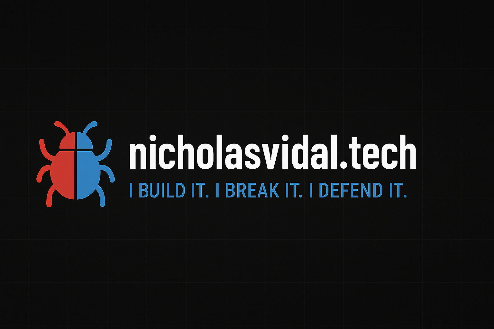

<p align="center">
  
</p>

<h1 align="center">Cyber Range Lab – Nicholas Vidal</h1>
<p align="center"><strong>I build it. I break it. I defend it.</strong></p>

# Cyber Range Lab – Nicholas Vidal

> ⚠️ **This project is a work in progress (WIP).**  
> Updates are ongoing as I build out my home lab infrastructure.

This is a hands-on Red Team and Blue Team cyber range built using real hardware, virtual machines, and Active Directory simulations. It serves as both a personal training ground and a live documentation project for others looking to build their own range.

---

## Table of Contents
- [Core Infrastructure](#-core-infrastructure)
- [Live Lab Journal](#-live-lab-journal)
- [Current TODOs](#-current-todos)
- [Badges](#-badges)

---

## 🧱 Core Infrastructure

- **bWAPP** (Docker) — vulnerable web app  
- **Kali Linux** (Docker) — attacker toolkit  
- **Wazuh** (Docker) — SIEM & EDR  
- **Nessus** (VM) — external vulnerability scanner  
- **OPNsense** (VM) — firewall & VLAN segmentation  
- **Active Directory** (VM) — Windows DC environment  
- **Pi-hole** (Docker) — DNS filtering & ad-blocking  
- …and more (see each folder’s README)

---

## 📓 Live Lab Journal

Track all progress, updates, and reflections in the [Cyber Range Lab Journal](https://zerohourcyber.github.io/docs/lab_journal).

---

 Quickstart

```bash
git clone https://github.com/Zerohourcyber/cyber-range-lab.git
cd cyber-range-lab
./setup.sh 


© 2025 Nicholas Vidal
